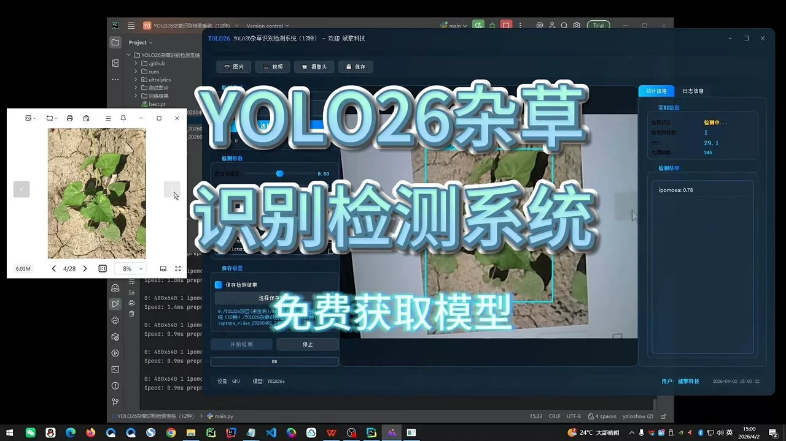
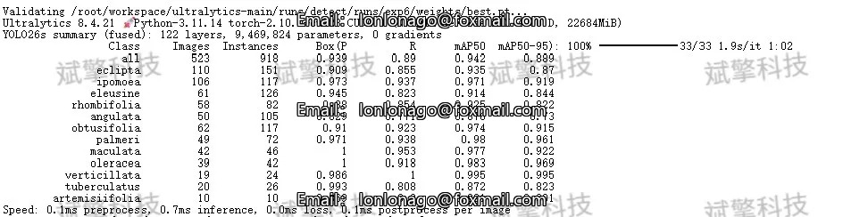
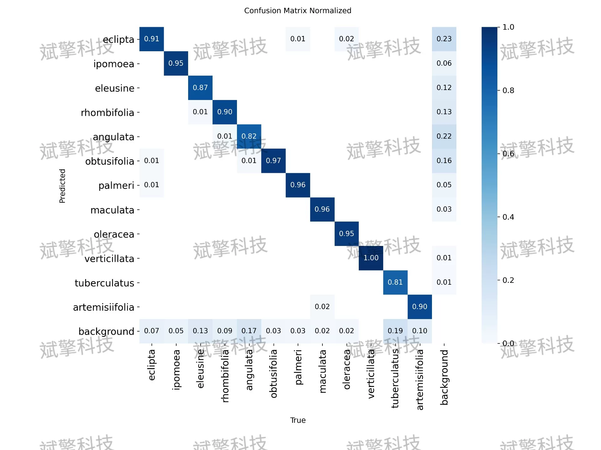
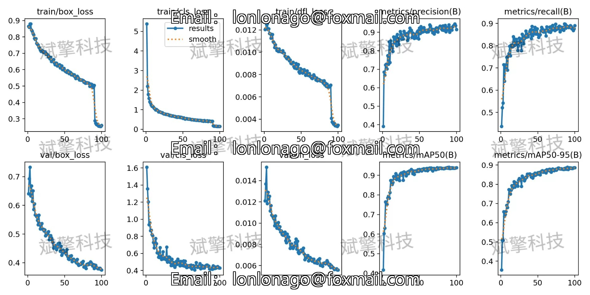
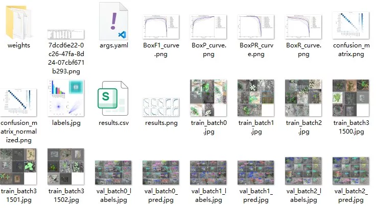
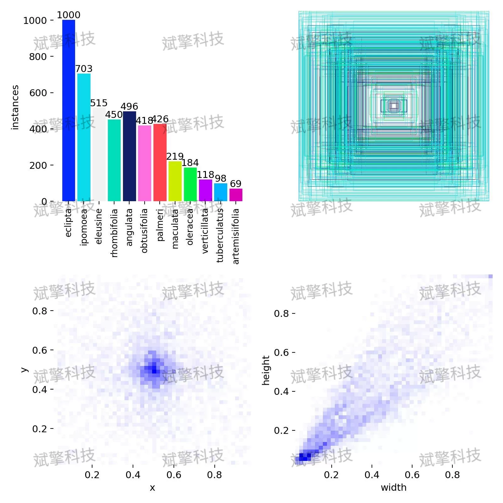
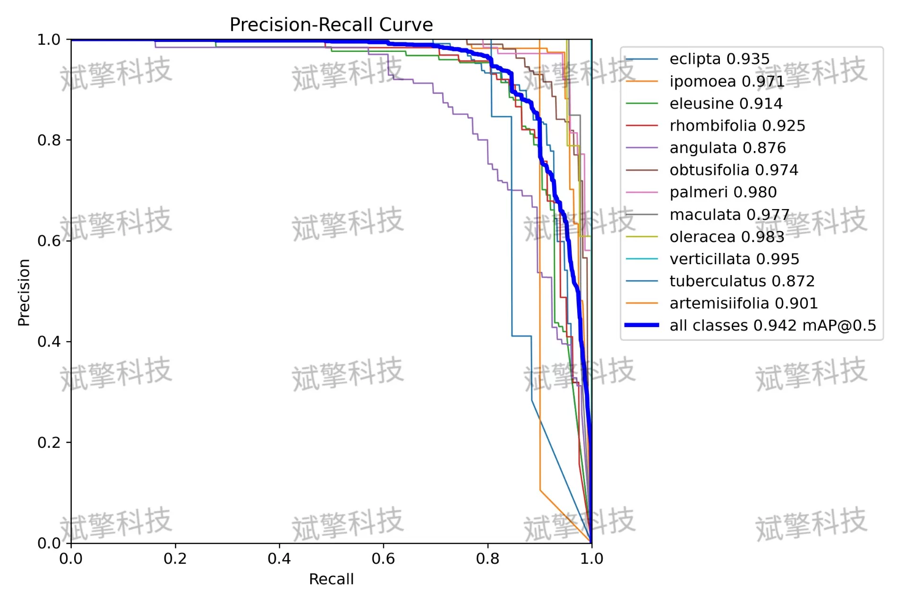
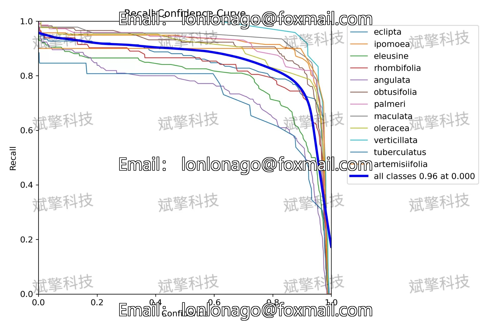
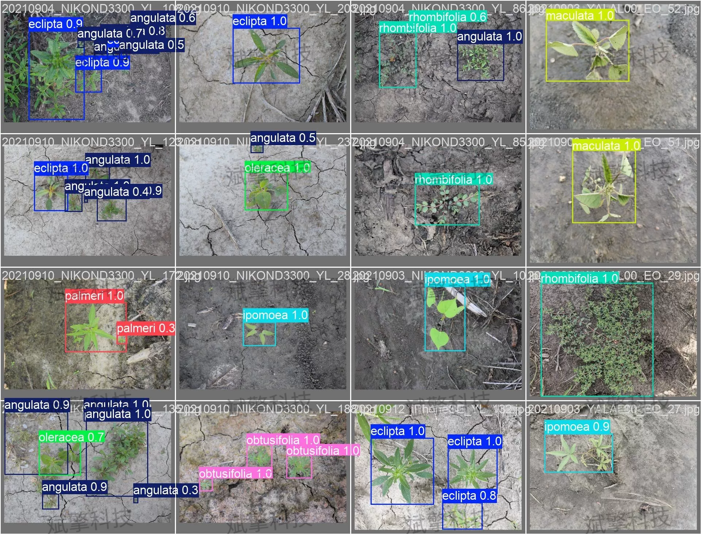

# YOLOv26 Grassland Identification Detection System | Model + Source Code

## Body

YOLO26 Weed Identification Detection System | Model + Source Code YOLO26 Weed Identification Detection System (12 Types) (Project Source Code + Dataset + Model Weights + UI Interface + Python + Deep Learning + Remote Environment Deployment)

Addressing the issue of diverse weed species in farmlands, low efficiency of manual identification, and subjective factors affecting identification, this paper constructs a weed identification detection system based on the YOLO26 object detection algorithm. The system covers 12 common weed types, using a total of 3,319 labeled images (2,796 training set, 523 validation set). Experimental results show that the model achieves an average precision mean (mAP50) of 0.942 on the validation set, with a precision rate of 0.939, among which some categories such as verticillata and oleracea have mAP50 values of 0.995 and 0.983 respectively. The confusion matrix analysis indicates that most categories have high recognition accuracy, while a few categories with insufficient sample volume exhibit certain missed or false positive phenomena. Overall, the proposed model achieves a good balance between lightweight and recognition performance, demonstrating potential for practical deployment.
————————————————
The dataset contains the following 12 types of weeds:
0    eclipta (Eel-intestine)    6    palmeri (Palmer Amaranth)
1    ipomoea (Ipomoea Flower)    7    maculata (Spotted Groundsel)
2    eleusine (Sorghum Grass)    8    oleracea (Malachite Green)
3    rhombifolia (Rhombifolium)    9    verticillata (Turnip Mustard)
4    angulata (Anguloa)    10    tuberculatus (Tuberculata)
5    obtusifolia (Obtusifolia)    11    artemisiifolia (Pesticide Weed)

Free remote installation appointment. Unsuccessful full refund.
Purchase Enjoy the following resources (Baidu Cloud automatically unlocks):
     YOLO Identification Detection Project Complete Source Code
     YoLO format Dataset
     Programming code + UI interface code
     Model after training + result images
 Software install package
Add WeChat to make a reservation for remote installation (Automatically display WeChat ID after purchase) - Unsuccessful, full refund

⚙️ Core Function Modules
Detection Capability
    Image Detection: Upon upload, return detection boxes + category information
    Video Detection: Supports video files, analyzes frames accurately
    Camera Real-time Detection: Integrates USB camera, realizes dynamic monitoring
Interaction and Control
    Target Filtering: Choose one or more categories for detection
    Parameter Real-time Adjustment: Adjustable confidence threshold & IoU threshold, flexible control of precision
    Result Save: One-click save images/video/camera detection results
System and Data
    User login registration: Supports password strength detection + encryption storage
    Log recording: Auto-record operation and error information (timestamped)

## Images

## Payment

Here is a pay link on Stripe ( https://buy.stripe.com/3cs8yP7sY87d0vu9AB ). Please contact me lonlonago@foxmail.com after funding $89, and I will send you a complete data files , thank you!

